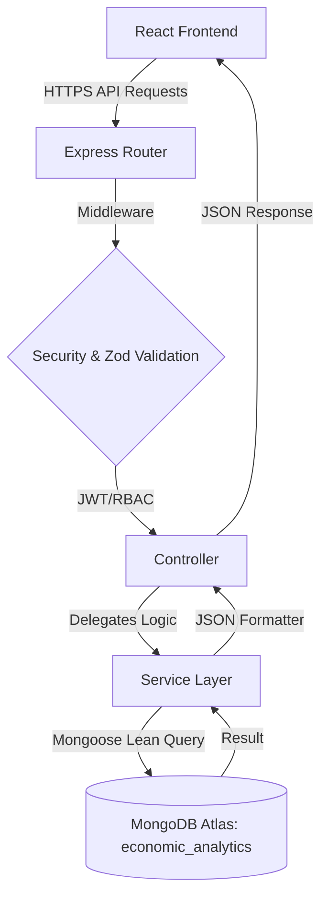

<div align="center">

# 📊 Human Capital Analytics | Full Stack Architecture

**Enterprise-Level Dashboard & Predictive Analytics System for Global Economic Intelligence**

[](https://reactjs.org/)
[](https://vitejs.dev/)
[](https://www.mongodb.com/)
[](https://expressjs.com/)
[](https://nodejs.org/)

**[🟢 Live Enterprise Dashboard (Vercel)](https://human-capital-project-prathvik-mehr.vercel.app)**
<br />
**[📘 View Postman API Documentation](https://documenter.getpostman.com/view/50841552/2sBXwpNrg8)**
<br />
**[🟢 Live API Base URL (Render)](https://human-capital-project-prathvik-mehra-1.onrender.com)**
<br /><br />
[Report Bug](https://github.com/Prathvikmehra/human_capital_project_prathvik_mehra/issues) · [Request Feature](https://github.com/Prathvikmehra/human_capital_project_prathvik_mehra/issues)

</div>

---

## 🌍 Project Vision

> _"Empowering global stakeholders with precision-engineered data visualizations and scalable intelligence architectures to decode the complexities of human capital and economic shifts."_

In an era of data-driven decision-making, the **Human Capital Analytics Platform** serves as a high-fidelity lens into the global economy. By processing vast amounts of real-world records into our custom `economic_analytics` database, this system provides analysts and enterprises with the tools to visualize inflation trends, consumer price indices, and demographic shifts through a seamless, interactive, and ultra-responsive full-stack architecture.

---

## 📖 Introduction

This project is an enterprise-grade **Full Stack Web Application** separated into a highly decoupled **Vite + React Frontend** and an **Express.js + Node.js Backend**.

The Frontend utilizes **Redux Toolkit** for complex state management, **Framer Motion** for fluid UI transitions, and **Recharts** for massive real-time telemetry dashboards. 
The Backend utilizes complex **MongoDB Aggregation Pipelines**, a strict **Controller-Service Architecture**, Role-Based Access Control (RBAC), and robust Zod validation. 

---

## 🛠️ Tech Stack Architecture

### 💻 Frontend (Client-Side)
| Technology             | Category            | Purpose                                                 |
| :--------------------- | :------------------ | :------------------------------------------------------ |
| **React + Vite**       | Core UI Framework   | High-speed rendering and instantaneous Hot Module Reload |
| **Redux Toolkit**      | State Management    | Centralized global state for Auth, Dashboard, and UI    |
| **Material-UI (MUI)**  | UI Component Library| Accessible, premium pre-built components                |
| **Recharts / Leaflet** | Data Visualization  | Complex telemetry graphing and interactive world maps   |
| **Framer Motion**      | Animations          | Physics-based micro-interactions and route transitions  |

### ⚙️ Backend (Server-Side)

| Technology             | Category            | Purpose                                                 |
| :--------------------- | :------------------ | :------------------------------------------------------ |
| **Node.js + Express**  | Web Server          | Scalable, event-driven JavaScript execution             |
| **MongoDB (Atlas)**    | Database            | Cloud NoSQL document storage (`economic_analytics`)     |
| **Mongoose**           | ODM                 | Strict schema modeling and high-speed lean querying     |
| **JWT & Bcrypt**       | Security            | Secure stateless authentication and password encryption |
| **Zod**                | Validation          | Strict TypeScript-first schema validation               |
| **Winston & Helmet**   | Security & Logging  | Production-level request tracking and HTTP hardening    |

---

## ✨ System Features

- **📱 Fully Responsive UI**: Flawless experience from 4K desktop monitors down to mobile devices.
- **🎨 Premium Dark/Light Modes**: Integrated theme switching across all interactive charts and UI elements.
- **🛡️ Secure JWT Authentication**: Robust cookie and local-storage token handling with route guards.
- **📊 Advanced Telemetry Dashboards**: Render up to 15 different data visualization widgets simultaneously.
- **⚙️ Service Layer Architecture**: 100% decoupling of database logic from HTTP controllers.
- **🛑 Intelligent Rate Limiting**: Protection against API abuse and brute-force attempts.

---

## 🏗️ System Architecture



---

## ⚙️ Installation & Setup

### 1. Repository Setup

```bash
git clone https://github.com/Prathvikmehra/human_capital_project_prathvik_mehra.git
cd human_capital_project_prathvik_mehra
```

### 2. Global Installation

This repository is a monorepo configured for seamless full-stack execution.
```bash
npm install
```
*(This automatically installs dependencies for both `frontend` and `backend` using the custom root `package.json` hooks).*

### 3. Backend Configuration
Create a `.env` file in the `/backend` folder:
```env
PORT=5000
MONGODB_URI=mongodb+srv://your_connection_string
JWT_SECRET=your_super_secret_key
CLIENT_URL=http://localhost:3000
```

### 4. Run Both Servers
Open two terminal instances:
```bash
# Terminal 1 (Backend)
cd backend
npm run dev

# Terminal 2 (Frontend)
cd frontend
npm run dev
```

---

## 👨‍💻 Author

**Prathvik Mehra**

- [GitHub](https://github.com/Prathvikmehra)

---

<div align="center">

### 🚀 Deciphering the world's data, one record at a time.

[Back to Top](#-human-capital-analytics--full-stack-architecture)

</div>
