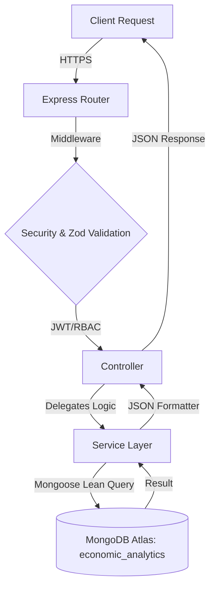

<div align="center">

# 📊 Human Capital Analytics | Full Backend Architecture

**Enterprise-Level Dashboard & Predictive Analytics System for Global Economic Intelligence**

[](https://www.mongodb.com/)
[](https://expressjs.com/)
[](https://nodejs.org/)

[Report Bug](https://github.com/Prathvikmehra/human_capital_project_prathvik_mehra/issues) · [Request Feature](https://github.com/Prathvikmehra/human_capital_project_prathvik_mehra/issues)

</div>

---

## 🌍 Project Vision

> _"Empowering global stakeholders with precision-engineered data visualizations and scalable intelligence architectures to decode the complexities of human capital and economic shifts."_

In an era of data-driven decision-making, the **Human Capital Analytics Platform** serves as a high-fidelity lens into the global economy. By processing vast amounts of real-world records into our custom `economic_analytics` database, this system provides analysts and enterprises with the tools to visualize inflation trends, consumer price indices, and demographic shifts through a seamless, interactive, and ultra-responsive backend architecture.

---

## 📖 Introduction

This project is an enterprise-grade backend solution built with **Node.js** and **Express.js**. It is architected for speed, security, and massive data handling.

Unlike standard backends, this system utilizes complex **MongoDB Aggregation Pipelines** and a strict **Controller-Service Architecture** to deliver real-time analytical insights. With built-in Role-Based Access Control (RBAC), robust Zod validation, and a strictly decoupled MVC design, it represents the pinnacle of modern backend engineering.

---

## 🛠️ Tech Stack Architecture

### ⚙️ Backend (Server-Side)

| Technology             | Category            | Purpose                                                 |
| :--------------------- | :------------------ | :------------------------------------------------------ |
| **Node.js**            | Runtime Environment | Scalable, event-driven JavaScript execution             |
| **Express.js (v5.x)**  | Web Framework       | Minimalist and flexible routing and middleware engine   |
| **MongoDB (Atlas)**    | Database            | Cloud NoSQL document storage (`economic_analytics`)     |
| **Mongoose**           | ODM                 | Strict schema modeling and high-speed lean querying     |
| **JWT & Bcrypt**       | Security            | Secure stateless authentication and password encryption |
| **Zod**                | Validation          | Strict TypeScript-first schema validation               |
| **Winston**            | Logging             | Production-level request tracking and error logging     |
| **Helmet & HPP**       | Protection          | Cross-origin security and HTTP header hardening         |

---

## ✨ System Features

### 🛡️ Backend Power

- **📊 15 Modular Routes**: Highly focused routing categories preventing code bloat.
- **⚙️ Service Layer Architecture**: 100% decoupling of database logic from HTTP controllers.
- **🔍 Dynamic Querying**: Complex filtering, multi-field sorting, and text-search logic natively built in.
- **🛑 Intelligent Rate Limiting**: Protection against API abuse and brute-force attempts.
- **🩺 Global Error Handling**: Centralized interception of Mongoose/JWT errors preventing server crashes.

---

## 🏗️ System Architecture



---

## 📁 Project Structure

```text
backend/
├── src/
│   ├── config/           # DB, CORS, and Cloudinary settings
│   ├── controllers/      # Route handler implementations
│   ├── middlewares/      # Error, Auth, Rate-Limit, and Log middlewares
│   ├── models/           # Mongoose schemas with indexing
│   ├── routes/           # Versioned API route definitions (15 modular files)
│   ├── services/         # Core business and database logic
│   ├── utils/            # Query builders, formatters, async handlers
│   ├── validators/       # Input validation schemas (Zod)
│   ├── app.js            # Express instance configuration
│   └── server.js         # HTTP Server Launcher
```

---

## ⚙️ Installation & Setup

### 1. Repository Setup

```bash
git clone https://github.com/Prathvikmehra/human_capital_project_prathvik_mehra.git
cd human_capital_project_prathvik_mehra/backend
```

### 2. Backend Configuration

```bash
npm install
cp .env.example .env
```

Ensure you configure your `.env` with your Atlas MongoDB connection string pointing to `economic_analytics` and your generated `JWT_SECRET`.

### 3. Run the Server
```bash
npm run dev
```

---

## 🔑 Environment Variables

| Variable             | Description       | Example                 |
| :------------------- | :---------------- | :---------------------- |
| `NODE_ENV`           | Environment State | `development`           |
| `LOCAL_MONGODB_URI`  | Connection String | `mongodb+srv://...`     |
| `JWT_SECRET`         | Auth Token Secret | `your_long_secure_hash` |
| `PORT`               | Server Port       | `5000`                  |

---

## 📡 Core API Routes

Our backend is broken down into 15 highly modular route structures mounted at `/api/v1/`:

- **`/auth`**: Registration, login, token refreshing, and OTPs.
- **`/prices`**: Fetch and filter global price metrics.
- **`/countries`**: Macro-economic stats and historical trends by nation.
- **`/indicators`**: Manage and retrieve specific economic indicators.
- **`/stats`**: Pre-calculated aggregations (averages, distributions).
- **`/search`**: High-velocity text search engines.
- **`/admin`**: Highly protected dashboard routes.
...and 8 more specialized routes!

---

## ⚡ Performance Optimization

- **DB Indexing**: Utilizing B-tree indexes for `O(log n)` lookup performance.
- **Lean Queries**: Using `.lean()` to bypass Mongoose document hydration.
- **Parallel Execution**: Utilizing `Promise.all()` for simultaneous count and fetch operations.
- **Compression**: Shrinking JSON payloads before they leave the Node server.

---

## 👨‍💻 Author

**Prathvik Mehra**

- [GitHub](https://github.com/Prathvikmehra)

---

<div align="center">

### 🚀 Deciphering the world's data, one record at a time.

[Back to Top](#-human-capital-analytics--full-backend-architecture)

</div>
