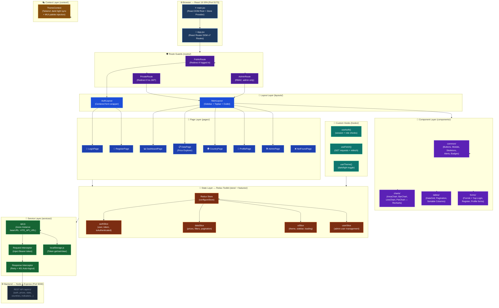
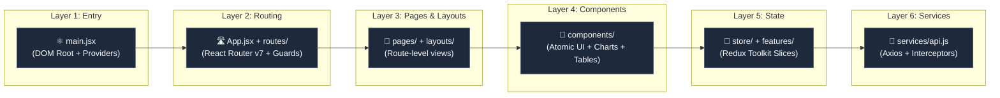
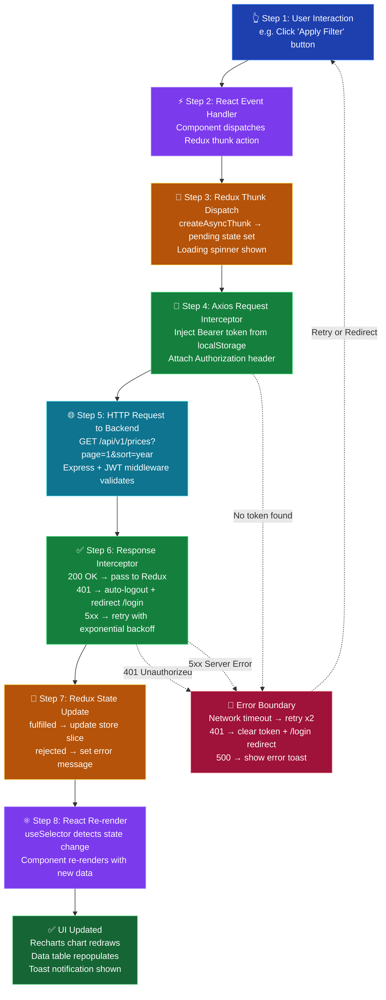
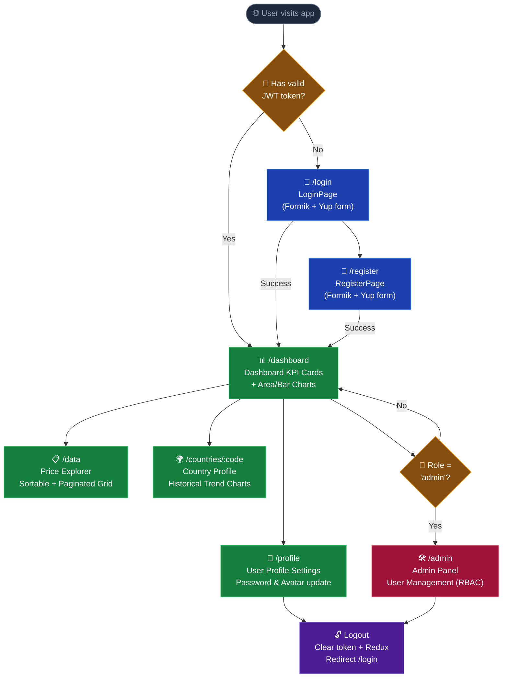
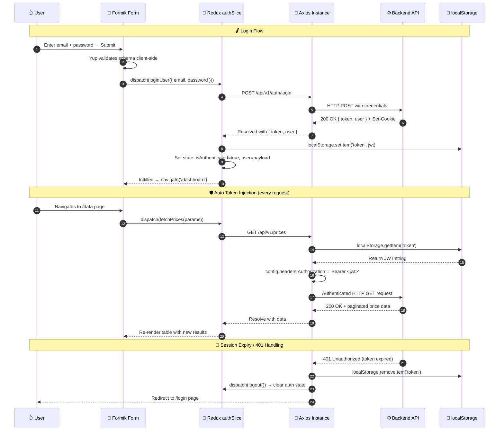
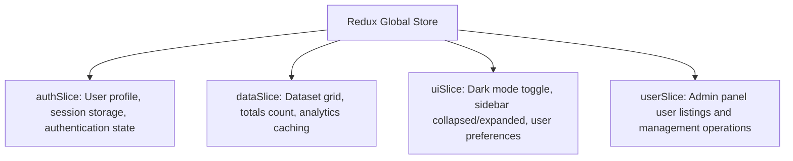

<div align="center">


# 📊 Human Capital Analytics | Client Application

**Enterprise-Grade React Dashboard, Real-Time Charting & Advanced Economics Analytics Platform**

[](https://react.dev/)
[](https://vite.dev/)
[](https://mui.com/)
[](https://tailwindcss.com/)
[](https://redux-toolkit.js.org/)
[](https://framer.com/motion/)

<br/>

[](https://human-capital-project-sahoo-priyabr.vercel.app/)

> A highly performant client-side application designed to visualize consumer price indices, inflation trends, and macro-economic factors utilizing interactive charting, advanced filtering, and a state-of-the-art Glassmorphic & Neumorphic design system.

---

</div>

## 🏗️ Full-Stack Frontend System Architecture

The Human Capital Analytics frontend is a fully decoupled, enterprise-grade **React 19 + Vite 8** SPA. The diagram below illustrates the **complete frontend architecture** — from the browser render layer down to the backend API communication:



---

## 🎯 Component-Driven Layer Architecture

The frontend enforces strict **Separation of Concerns (SoC)** across 6 distinct layers, flowing from browser entry point down to the API:



---

## 🔄 Frontend Request Lifecycle Workflow

Every user interaction passes through **8 sequential stages** before the UI updates. This ensures predictable state, clean error handling, and optimized re-renders:



---

## 👤 User Journey & Page Navigation Flow



---

## 🔐 Authentication Workflow (Frontend)



---

## 📈 Frontend UI & Business Workflow

The client application provides a highly visual, step-by-step data analysis journey for end-users:

```mermaid
graph LR
    A["🔑 Login\n/ RBAC Auth"] --> B["📊 Dashboard\nKPI Overview"]
    B --> C["🏷️ Select\nIndicator"]
    C --> D["🔍 Apply\nData Filters"]
    D --> E["🧠 Redux Thunk\nfetchPrices()"]
    E --> F["📈 Recharts\nRe-render"]
    F --> G["📤 Export\n& Share"]

    classDef default fill:#1e293b,stroke:#475569,stroke-width:1px,color:#f8fafc;
    classDef auth fill:#2563eb,stroke:#1d4ed8,stroke-width:2px,color:#fff;
    classDef view fill:#8b5cf6,stroke:#7c3aed,stroke-width:2px,color:#fff;
    classDef state fill:#d97706,stroke:#b45309,stroke-width:2px,color:#fff;
    classDef success fill:#059669,stroke:#047857,stroke-width:2px,color:#fff;

    class A auth;
    class B,C,D view;
    class E state;
    class F,G success;
```



---

## 🌌 System Capabilities

| Module | Capability | Key Technologies |
| :--- | :--- | :--- |
| 🔐 **Enterprise Authentication** | JWT sessions, HTTP-only cookies, multi-level RBAC route guards | JWT, React Router, Redux |
| 📈 **Dashboard Viewports** | Real-time KPI cards, indicator counts, country volumes, interactive charts | Recharts, Redux, MUI |
| 📊 **Dynamic Data Explorer** | Server-side pagination, multi-column sorting, complex category filtering | Redux Toolkit, Axios |
| 🗺️ **Country Profiles** | Geo-economic tabs, historical index trends, growth indices, comparisons | Recharts, Redux |
| ⚙️ **Platform Configuration** | Credential updates, browser session tracking, user profile management | Formik, Yup, Redux |
| 🔄 **Comparative Analytics** | Side-by-side country comparisons, yearly trend overlays, distributions | Recharts, Axios |

---

## 🎨 Design System & Custom Components

The visual framework blends **Tailwind CSS** with **Material-UI (MUI)** to construct dark/light themes featuring Neumorphic elements:

### 1. Unified Theme Context (`context/ThemeContext.jsx`)
React context coordinates state between Redux UI settings and the HTML root element class list:
*   **Tailwind Mode**: Synchronizes `.dark` or `.light` selector state on the HTML root element:
    ```javascript
    useEffect(() => {
      const root = window.document.documentElement;
      root.classList.remove('light', 'dark');
      root.classList.add(themeMode);
    }, [themeMode]);
    ```
*   **MUI Integration**: Injectable palettes that style text fields, panels, paper sheets, and modals dynamically depending on active state.

### 2. Micro-Interactions & Transitions
*   **Framer Motion**: Smooth spring animations (`type: "spring", stiffness: 120`) wrapping navigation transitions, cards, lists, and modal overlays to prevent layout shifts.
*   **Tactile Feedback**: Active neumorphic borders (`0 0 10px rgba(99,102,241,0.8)`) applied to status cards.

---

## 🧠 Central State Management (Redux Store)

We use **Redux Toolkit** to handle UI state, cached datasets, and server responses in a predictable single-source-of-truth container:



### Redux Slice Breakdown & Key Thunks

| Slice | State Managed | Key Async Thunks |
| :--- | :--- | :--- |
| `authSlice.js` | User profile, JWT token, `isAuthenticated` flag | `loginUser`, `registerUser`, `fetchCurrentUser`, `logoutUser` |
| `dataSlice.js` | Price records, pagination state, sort/filter params | `fetchPrices`, `createPrice`, `updatePrice`, `deletePrice` |
| `uiSlice.js` | `sidebarOpen`, theme mode, loading indicators | N/A — synchronous reducers only |
| `userSlice.js` | Admin user list, role management | `fetchAllUsers`, `updateUserRole`, `deleteUser` |

---

## 🛡️ Input Validation & Form Schema

Forms are powered by **Formik** and validated client-side with **Yup** schemas:

| Field | Rule | Error Message |
| :--- | :--- | :--- |
| `name` | Min 2 characters, required | "Name must be at least 2 characters" |
| `email` | Valid email format, required | "Enter a valid email" |
| `password` | Min 8 chars + lowercase + uppercase + number | "Password must contain a lowercase/uppercase letter/number" |
| `role` | Enum: `user` \| `admin` (optional) | "Invalid role value" |

```javascript
const validationSchema = Yup.object({
  name: Yup.string().min(2, 'Name must be at least 2 characters').required('Name is required'),
  email: Yup.string().email('Enter a valid email').required('Email is required'),
  password: Yup.string()
    .min(8, 'Password must be at least 8 characters')
    .matches(/[a-z]/, 'Password must contain a lowercase letter')
    .matches(/[A-Z]/, 'Password must contain an uppercase letter')
    .matches(/[0-9]/, 'Password must contain a number')
    .required('Password is required'),
});
```

---

## 🎣 Custom React Hooks

| Hook | File | Usage | Returns |
| :--- | :--- | :--- | :--- |
| `useAuth()` | `hooks/useAuth.js` | Check session + RBAC role | `{ user, isAuthenticated, role }` |
| `useFetch()` | `hooks/useFetch.js` | Read-only GET requests | `{ data, loading, error, refetch }` |
| `useTheme()` | `hooks/useTheme.js` | Dark/light mode toggle | `{ themeMode, toggleTheme }` |

```javascript
// Example: useFetch in a component
const { data, loading, error, refetch } = useFetch('/stats/distribution');
```

| Return Value | Type | Description |
| :--- | :---: | :--- |
| `data` | `any` | Parsed backend JSON response payload |
| `loading` | `boolean` | `true` while network request is in-flight |
| `error` | `string \| null` | Error message on failure, `null` on success |
| `refetch()` | `function` | Manually re-triggers the GET request |

---

## 🛡️ Token Lifecycle & Axios Interceptors

All API communication flows through `services/api.js` with 3 automatic interceptor behaviors:

| # | Interceptor | Trigger | Action |
| :---: | :--- | :--- | :--- |
| 1 | **Bearer Token Injection** | Every outgoing request | Read `localStorage` → append `Authorization: Bearer <jwt>` header |
| 2 | **Exponential Backoff Retry** | 5xx server error response | Retry up to **2 times** with 1s → 2s progressive delay before failing |
| 3 | **Auto-Logout on 401** | `401 Unauthorized` response | Clear `localStorage` → `dispatch(logout())` → redirect to `/login` |

```javascript
// Request Interceptor — Token Injection
config.headers.Authorization = `Bearer ${token}`;

// Response Interceptor — 401 Auto-Logout
if (error.response?.status === 401) {
  localStorage.removeItem('token');
  store.dispatch(logout());
  window.location.href = '/login';
}
```

---

## 📐 Strict Architectural Principles

| Principle | Rule | Enforcement |
| :--- | :--- | :--- |
| **250-Line Limit** | No `.jsx`/`.js` file may exceed 250 lines | Extract sub-components into `/components` subdirectory |
| **Separation of Concerns** | Visual logic stays in views; state in Redux; API in services | Code review enforced |
| **Lean Components** | Components must not contain direct `axios` calls | All API calls via Redux thunks or `useFetch` hook |
| **Named Exports** | All components use named exports (no default export) | ESLint enforced |

---

## 📂 Folder & Component Blueprint

```text
frontend/
├── 🌍 public/                   # Static SEO assets, icons, and configuration files
├── 📂 src/
│   ├── 🖼️ assets/               # Branding assets, logo SVGs, and fallback illustrations
│   ├── 🧱 components/           # Reusable Atomic UI Architecture
│   │   ├── common/              # Global UI elements (Buttons, Skeleton Loaders, Modals)
│   │   ├── forms/               # Central Formik forms with Yup validators
│   │   ├── tables/              # Modular Data grids with sorting/pagination hooks
│   │   └── charts/              # Recharts wrapper templates (Area, Bar, and Line charts)
│   ├── 🎭 context/              # Global React context providers (Theme, UI settings)
│   ├── 🧠 features/             # Redux Slices coordinating state (Auth, Data, Users)
│   ├── 🎣 hooks/                # Custom React hooks encapsulating state logic (useAuth, useFetch)
│   ├── 📐 layouts/              # Parent wrappers establishing page grid structures
│   ├── 📄 pages/                # Route-level views containing page logic
│   ├── 🛡️ routes/               # Protected route gates and access-control boundaries
│   ├── 🔌 services/             # Axios connection wrappers, interceptors, and local storage utilities
│   ├── 🎨 styles/               # Global CSS files housing Tailwind directives
│   └── 🛠️ utils/                # Pure formatting and mathematics helper modules
```

---

## ⚡ Quick Start Guide

### 1️⃣ Dependencies Installation
Navigate to the root client folder and install required dependencies:
```bash
cd frontend
npm install
```

### 2️⃣ Environment Configuration
Create a `.env` file in the root of the `frontend/` directory:
```env
# URL pointer to the local Express server
VITE_API_URL=http://localhost:5000/api/v1

# Brand configuration
VITE_APP_NAME="Human Capital Analytics"
```

### 3️⃣ Running the App
Launch the Vite server locally with fast HMR:
```bash
npm run dev
```
Open **[http://localhost:5173](http://localhost:5173)** in your browser.

---

## 🕹️ Command Reference

| Command | Action |
| :--- | :--- |
| `npm run dev` | Runs the local development server (Vite). |
| `npm run build` | Builds the optimized production bundle of static files in the `/dist` directory. |
| `npm run preview` | Locally serves the compiled production build to verify bundles. |
| `npm run lint` | Runs ESLint to check syntax styles and structural warnings. |
| `npm run format` | Runs Prettier to auto-format files inside `/src`. |

---

## 📜 License

Distributed under the **MIT License**. See [LICENSE](file:///c:/Users/priyabrata/Desktop/Human_Capital/human_capital_project_sahoo_priyabrata/LICENSE) for more details.

<p align="left">
  <a href="https://opensource.org/licenses/MIT">
    
  </a>
</p>

---

## 👨‍💻 Developer & Author

<table align="center" style="border: none; background: transparent; border-collapse: collapse;">
  <tr style="background: transparent; border: none;">
    <td align="center" style="border: none; padding: 24px;">
      <a href="https://github.com/priyabratasahoo780">
        
      </a>
      <br /><br />
      <strong style="font-size: 1.25rem; color: #f8fafc;">Priyabrata Sahoo</strong>
      <br />
      <span style="color: #94a3b8; font-size: 0.95rem;">Full-Stack Software Engineer & Platform Architect</span>
    </td>
  </tr>
  <tr style="background: transparent; border: none;">
    <td align="center" style="border: none; padding-bottom: 24px;">
      <a href="https://github.com/priyabratasahoo780" target="_blank">
        
      </a>
      &nbsp;&nbsp;
      <a href="https://www.linkedin.com/in/priyabrata-sahoo/" target="_blank">
        
      </a>
    </td>
  </tr>
</table>

---

<div align="center">

<h3>🚀 Deciphering the world's data, one record at a time.</h3>

<br />

<a href="#-human-capital-analytics--client-application">
  
</a>

</div>
